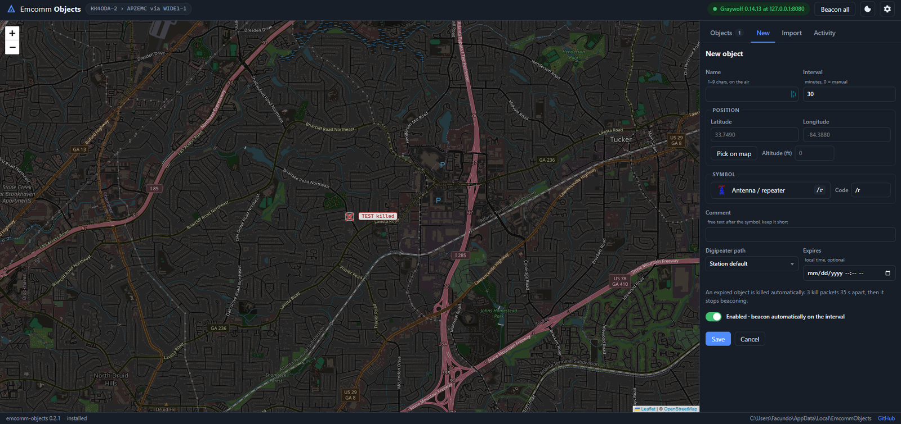

# Emcomm Objects

[](https://github.com/KK4ODA/emcomm-objects/releases/latest)
[](https://github.com/KK4ODA/emcomm-objects/actions/workflows/ci.yml)
[](LICENSE)

Companion app for [Graywolf APRS](https://github.com/chrissnell/graywolf): create, place, schedule and
beacon **APRS objects** (shelters, EOCs, aid stations, incident sites, served agencies, deployed units)
from a browser. Objects go on the air through Graywolf, and with Graywolf's iGate they reach APRS-IS
and aprs.fi. Built for use alongside Graywolf and [VarMap](https://github.com/KK4ODA/VarMap) rather
than as a full APRS client.



## What it does

- Keeps your objects in a JSON file compatible with Pinpoint APRS's `pinpointAprsObjects.json` (copy yours in).
- Beacons each object on its own interval, kills it on request or at an expiry time (three `_` kill packets,
  35 s apart, then silence) and can revive it later.
- Sends through **Graywolf's REST API** (default, works with a stock Graywolf) or **KISS over TCP**
  (Graywolf's KISS interface or any KISS TNC).
- Web UI: map with symbol markers and countdown labels, object cards with search and filters, a searchable
  APRS symbol chart, CSV import with automatic 9-character names, CSV export, an activity feed of every
  packet, light and dark themes.
- Checks for new releases and, on Windows, updates itself.

## What it does not do

- Talk to APRS-IS directly. Graywolf's iGate handles gating.
- Receive or display incoming traffic. That is Graywolf's map (and VarMap's, which shows Graywolf's APRS
  stations and objects next to VarAC stations).

## Install

**Windows.** Download `EmcommObjects-Setup-<version>.exe` from the
[Releases page](https://github.com/KK4ODA/emcomm-objects/releases) and run it. It installs per-user
(no administrator prompt), adds a Start-menu entry, optional desktop shortcut and start-with-Windows,
and opens the UI at http://127.0.0.1:8765. Prefer no installer? Take
`emcomm-objects-<version>-windows-x64-portable.zip`, unzip anywhere, run `emcomm-objects.exe`.

**macOS / Linux / Raspberry Pi.** Unpack the matching `.tar.gz`, run `./emcomm-objects`, open
http://127.0.0.1:8765. The macOS binary is not code-signed: right-click > Open the first time.

**From source** (Go 1.22+):

```bash
git clone https://github.com/KK4ODA/emcomm-objects
cd emcomm-objects
go run ./cmd/emcomm-objects
```

Where files live: the installed Windows build keeps `config.yaml`, `objects.json` and
`emcomm-objects.log` in `%LOCALAPPDATA%\EmcommObjects`; portable and source runs keep them beside the
executable (or in the working directory under `go run`). `--data <dir>` overrides either.

## First run

The app starts, opens your browser and shows **Settings**:

1. **Callsign-SSID** to beacon from, e.g. `N0CALL-12`. Use an SSID that is *not* Graywolf's own station
   SSID, so the iGate does not treat your objects as its own traffic.
2. **Radio transport**:
   - **Graywolf API** (recommended): Graywolf URL (`http://127.0.0.1:8080`), the username and password you
     use for Graywolf's web UI, and *Send to* (RF only, RF + APRS-IS, or APRS-IS only for a station without
     a transmitter). *Test connection* confirms the login and fills the radio channel list.
   - **KISS over TCP**: in Graywolf add a KISS Interface of type **TCP**, mode **modem** (mode `tnc`
     silently drops injected frames), listen address `127.0.0.1:6700`, KISS port 0 mapped to your APRS
     channel. Then enter `127.0.0.1:6700` here.
3. Save. The pill in the top bar turns green when the radio link is up.

Create objects with **New** (click *Pick on map* to place them), or import a CSV. Imported objects start
disabled so nothing goes on the air until you enable it.

### How Graywolf mode works

Every object becomes one *object* beacon in Graywolf (disabled there, so Graywolf's own scheduler never
fires it) and Emcomm Objects calls *send now* on your schedule. A kill temporarily turns the same beacon
into a *custom* beacon that carries the spec-exact `;NAME     _DDHHMMz…` info field, and the beacon is
deleted once the kill sequence has drained or when you delete the object. You will see the beacons on
Graywolf's Beacons page; leave them alone.

## Config file

`config.yaml` (see [`config.example.yaml`](config.example.yaml)) mirrors Settings: `station`, `transport`
(`graywolf` or `kiss`), `graywolf`, `kiss`, `storage`, `web`, `updates`. Everything except the web address
and the objects file applies live when saved from the UI. `--init-config` writes the annotated template.

## Command line

```
emcomm-objects                    run (transport + scheduler + web UI)
emcomm-objects --no-browser       run without opening the browser
emcomm-objects --data D:\eo       use another data directory
emcomm-objects --beacon NAME      send one live beacon and exit
emcomm-objects --list             list objects and exit
emcomm-objects --init-config      write config.yaml and exit
emcomm-objects --version
```

The Windows release binary has no console window (logs go to `emcomm-objects.log` and the Activity tab);
use the source build for the `--list` / `--beacon` style commands.

## API

The web UI is a thin client over a local JSON API that other tools may use (VarMap-style):

| Endpoint | Purpose |
| --- | --- |
| `GET /api/objects` | all objects, Pinpoint-shaped JSON (`ObjectName`, `Latitude`, `Longitude`, `SymbolTable`, `SymbolID`, `Comment`, `IntervalMinutes`, `LastBeacon`, `Enabled`, `Status`, …) |
| `GET /api/objects.csv` | CSV export |
| `PUT /api/objects/{name}`, `DELETE /api/objects/{name}` | create/update, delete |
| `POST /api/objects/{name}/beacon`, `/kill`, `/revive` | actions |
| `POST /api/objects/beacon-all` | send every enabled object now |
| `GET /api/status` | version, transport state, station, paths, update state |
| `GET /api/config`, `PUT /api/config` | settings (the Graywolf password is never returned) |
| `POST /api/graywolf/test` | try Graywolf credentials |
| `GET /api/update`, `POST /api/update/check`, `/apply`, `/skip` | updater |
| `GET /api/events` | Server-Sent Events: `packet`, `state`, `log`, `objects`, `config`, `update` |

## Updating

The app checks GitHub at start and every 12 hours (only the version number is fetched). When a newer
release exists an orange **Update** pill appears:

- **Windows** (installer or portable): click it and choose *Install now*. The release is downloaded,
  verified against `SHA256SUMS.txt`, the app closes, installs and reopens. Settings and objects are kept.
- **macOS / Linux / source**: the pill links to the release page.

Settings → Updates has the toggle, the interval, *Check now*, and the update dialog has *Skip this version*.

## Building a release

`release.bat 0.2.0` runs the tests, tags `v0.2.0` and pushes; GitHub Actions builds the Windows installer
and portable zip, the macOS and Linux tarballs and `SHA256SUMS.txt`, and publishes them with the matching
section of `CHANGELOG.md` as release notes. `packaging\build.ps1 -Version 0.2.0` does the same build locally
(needs Go, and Inno Setup 6 for the installer).

## Third-party assets

APRS symbol sprites from [hessu/aprs-symbols](https://github.com/hessu/aprs-symbols) by Heikki Hannikainen
(OH7LZB), derived from Stephen Smith's (WA8LMF) set; see `internal/web/ui/symbols/COPYRIGHT.md`.
Maps by [Leaflet](https://leafletjs.com) with [OpenStreetMap](https://www.openstreetmap.org/copyright) tiles.

## License

[MIT](LICENSE).
